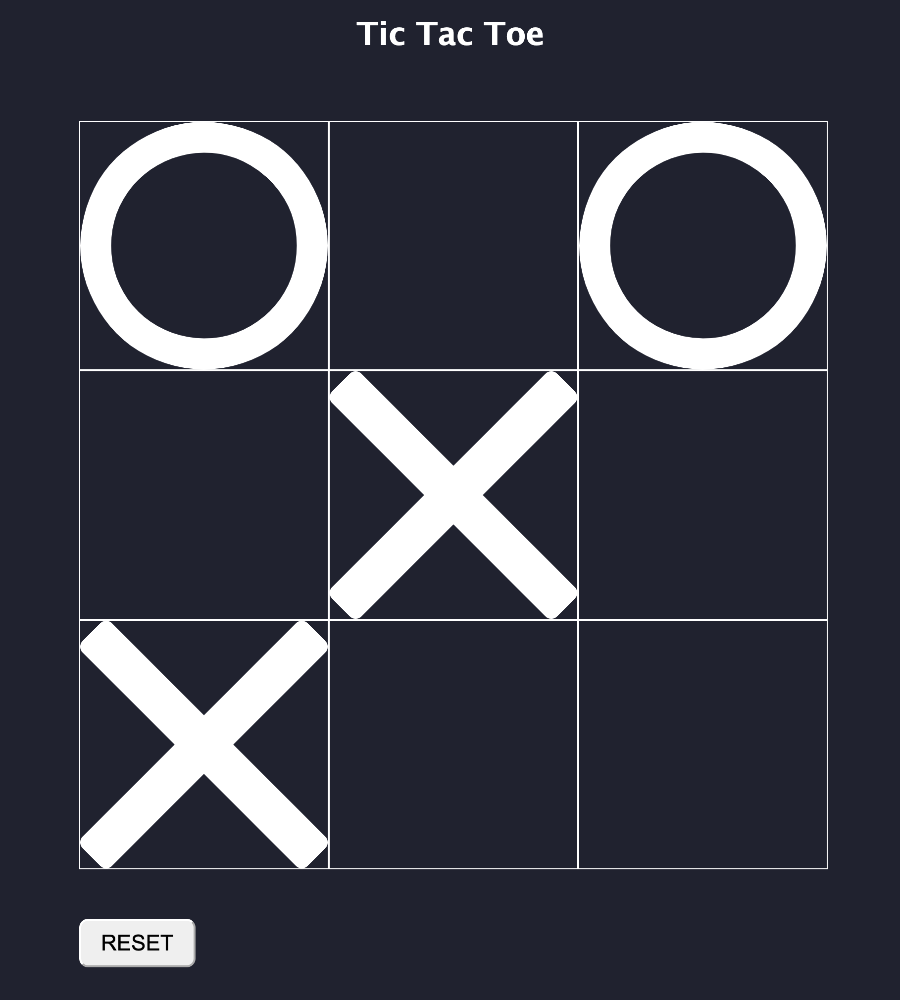

# TicTacToe

- Written in HTML, CSS and JavaScript

I started by drawing a 3x3 grid using CSS. I then used CSS to toggle the background of each square with an X on click, later using a counter to switch to O for the successive player based on even or odd turns. I then had to switch off event listeners on boxes that had been clicked.

To get win conditions, I wrote manual conditions for the NodeList of each square's index, such that if boxes/NodeList indexes 0, 1 and 2 all shared the same 'x' or 'o' CSS background classes, then to toggle 'X wins' or 'O wins' in an invisible h2 underneath the title. I then manually coded this for each of the win conditions. I also made the backgrounds of the winning columns, rows or diagonals green. 

I created a reset button that triggers a function to clear the classes on each of the boxes, and to set the h2 text invisible.

The draw condition is met when the turn counter has reached the length of the board and an equal number of Xs and Os have been placed. This could have also used a better check.

I would like to have made a more concise or elegant solution for toggling the classes and storing/checking positions, perhaps by creating custom arrays or objects. I found the DOM NodeList fiddly.

I used SVGs for X and O found here:
-  X from https://www.svgrepo.com/svg/12848/x-symbol
- O from https://www.svgrepo.com/svg/514076/circle